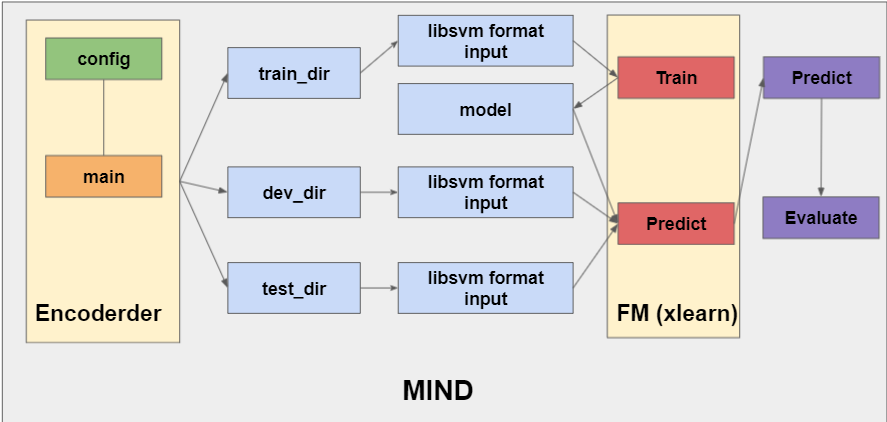

# MIND news recommadation using FM

## Clone this repo
```bash
git clone --recurse-submodules git@github.com:king0980692/mind.git
```

## Folder structure



## Data transformation and encoding

Before starting to feed data into model, we need to do some preprocess for MIND news dataset.

:bulb: Go to see the *encoderder* submodule to get more information 
